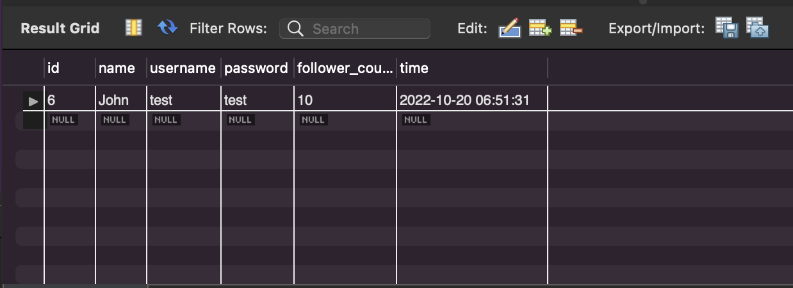

# MySQL Statement Practices

## Table of Contents
* [Part 3](#part-3)
* [Part 4](#part-4)
* [Part 5](#part-5)

## Part 3

    SELECT * FROM member;

    SELECT * FROM member ORDER BY time DESC;

    SELECT * FROM member ORDER BY time DESC LIMIT 3 OFFSET 1;

    SELECT * FROM member WHERE username = 'test';

    SELECT * FROM member WHERE username = 'test' and password = 'test';

    SET SQL_SAFE_UPDATES = 0;
UPDATE member SET name = 'test2' WHERE username = 'test';

 
## Part 4
    SELECT COUNT(*) FROM member;

    SELECT SUM(follower_count) FROM member;

    SELECT AVG(follower_count) FROM member;

## Part 5

    SELECT * FROM message;

    SELECT member.name, message.content FROM message INNER JOIN member ON message.member_id=member.id;

    SELECT member.name, message.content FROM message INNER JOIN member ON message.member_id=member.id and member.username='test';

SELECT member.name, AVG(like_count) FROM message INNER JOIN member ON message.member_id=member.id and member.username='test' Group By member.name;

